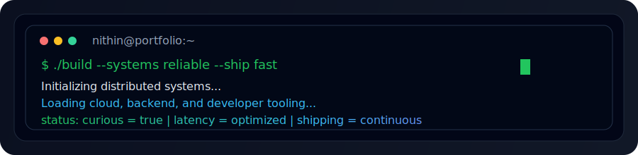
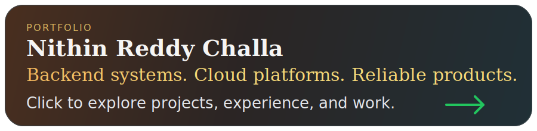

# Hi, I'm Nithin Reddy Challa

  

## About Me

  Software engineer focused on <strong>backend systems</strong>, <strong>cloud infrastructure</strong>, and <strong>polished product experiences</strong>.

  <code>Distributed Systems</code>
  <code>Platform Engineering</code>
  <code>Reliability</code>
  <code>Developer Productivity</code>

## Tech Stack

| Category | Tools |
| --- | --- |
| **Programming** |        |
| **Back-End** |     |
| **Front-End** |       |
| **Datastores** |      |
| **Cloud and DevOps** |      |

  

  
  

  

## Portfolio

  

## Featured Projects

### [Book Mart](https://github.com/nchalla5/BookMart)
Marketplace for buying and selling used books with a full-stack Go and React architecture.
Built with authentication, listing flows, checkout, and AWS-backed storage.
`Go` `React` `REST APIs` `JWT` `DynamoDB` `S3`

### [Scrum Simulator](https://github.com/nchalla5/Scrum-Simulator)
Java desktop application for simulating Scrum roles, sprint planning, and project workflows.
Designed around role-based actions, reporting, and team collaboration features.
`Java` `Swing` `Maven` `MySQL` `JDBC` `JUnit 5` `Mockito`

### [Flight Status Predictor](https://github.com/nchalla5/Flight-Status-Predictor)
Machine learning project for predicting flight arrival outcomes from historical airline data.
Focused on feature engineering, model comparison, and classification performance.
`Python` `pandas` `scikit-learn` `XGBoost` `matplotlib`

## Experience

<table align="center" width="100%">
  <tr>
    <td width="42%" align="right" valign="middle">
      <strong>Oracle</strong> 
      Software Engineer Intern 
      Jan 2021 - Jun 2021 
      Enterprise software engineering
    </td>
    <td width="16%" align="center" valign="middle">
       
      <strong>2021</strong> 
      <code>|</code>
    </td>
    <td width="42%"></td>
  </tr>
  <tr>
    <td></td>
    <td align="center"><code>|</code></td>
    <td align="left" valign="middle">
      <strong>Oracle</strong> 
      Associate Software Developer 
      Jul 2021 - Jul 2023 
      Enterprise software engineering
    </td>
  </tr>
  <tr>
    <td align="right" valign="middle">
      <strong>ResMed</strong> 
      Platform Engineer Intern 
      May 2024 - Dec 2024 
      Cloud and platform tooling
    </td>
    <td align="center" valign="middle">
       
      <strong>2024</strong> 
      <code>|</code>
    </td>
    <td></td>
  </tr>
  <tr>
    <td></td>
    <td align="center" valign="middle">
       
      <strong>2025</strong> 
      <code>|</code>
    </td>
    <td align="left" valign="middle">
      <strong>Auto BIM Route AI</strong> 
      Software Engineer Intern 
      Jan 2025 - May 2025 
      Product development
    </td>
  </tr>
  <tr>
    <td align="right" valign="middle">
      <strong>Sigma</strong> 
      Software Engineer 
      Oct 2025 - Jan 2026 
      Production engineering
    </td>
    <td align="center" valign="middle">
       
      <strong>2025 - 2026</strong>
    </td>
    <td></td>
  </tr>
</table>

## Education

- M.S. in Software Engineering, Arizona State University
- B.E. in Computer Science, Osmania University

## Connect With Me

  

  
  &nbsp;&nbsp;&nbsp;
  
  &nbsp;&nbsp;&nbsp;
  

If you'd like to collaborate or talk software, reach out on [LinkedIn](https://www.linkedin.com/in/nithin-challa), by email at [nchalla5@asu.edu](mailto:nchalla5@asu.edu), or at [challa.nithin.email@gmail.com](mailto:challa.nithin.email@gmail.com).
